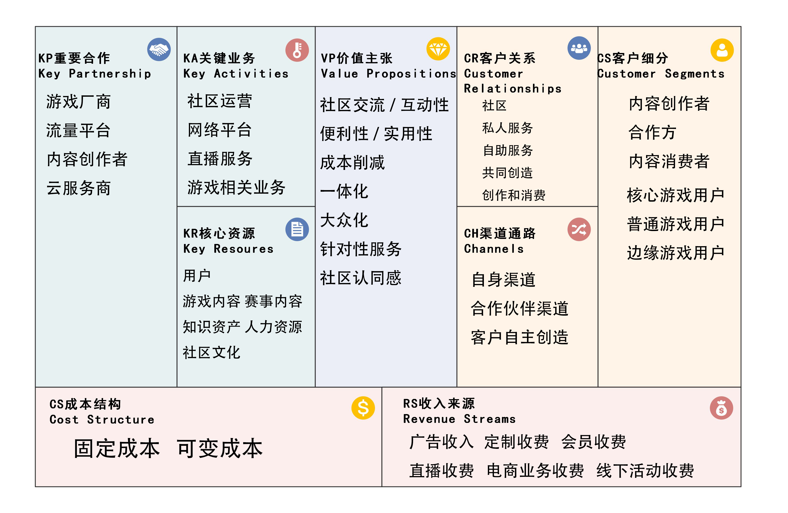

# 项目启动文档

[TOC]

## 一、基本信息

### 1.项目题目

**For Gamers 为游戏玩家而生**

### 2.组员信息

| 姓名             | 学号      |
| ---------------- | --------- |
| 李孟宇**（PM）** | 221250084 |
| 劳厚新           | 221250013 |
| 何文杰           | 221250174 |
| 马浚淇           | 221250107 |

### 3.度量数值

- 总要点数：62
- 平均要点数：（约为）7

## 二、项目简介

近几年随着网络游戏的蓬勃发展，各种游戏内容出现在了大众视野中，电竞赛事也在日常生活中越来越流行。由此我们希望打造一款面向所有游戏用户的社区平台，更好地为游戏玩家服务。

该软件旨在为每一个游戏玩家、游戏内容爱好者构建一个集游戏内容、游戏攻略、游戏电竞、赛事内容等内容为一体的一站式平台，专注于用每一个用户提供优质的游戏相关服务。我们相信科技的力量，以游戏内容为基础，不断创造出适合游戏玩家的游戏平台，使得各种游戏爱好者都能在平台上获得良好体验，通过优质内容输出不断扩大平台规模，最终实现我们的愿景——成为最好的游戏内容在线交流社区。针对不同的游戏爱好者，我们都有相应的模块服务：为重度游戏玩家提供游戏攻略，游戏技术指导服务；为轻度游戏玩家提供优质游戏推荐，趣味游戏分享；为电竞赛事爱好者提供赛事直播，赛事视频；为游戏内容创作者提供创作平台，助力内容创作；为游戏厂商提供内容发布平台，吸引更多人加入游戏。

总体上，我们希望打造一个这样的一站式平台，为游戏玩家提供优质的游戏相关服务，促进游戏相关产业的良性发展。

## 三、商业模式画布

### 1.客户细分

1. 按使用平台的用途分类

- 内容创作者
  - 指输出自身观点，提供相关游戏内容的用户。这类用户大多为视频创作者或攻略创作者，是平台前进发展的主要推动用户，平台的流量来源多为这些用户创作的内容。
- 合作方
  - 指与平台有相关合作，为平台投放游戏，直播等业务的用户。这类用户多为游戏官方厂商或其他产品厂商，是产品收入的重要来源，同时也为产品发展吸引流量，与产品之间相互促进。
- 内容消费者
  - 指浏览平台视频内容，文字内容，直播内容的一般用户。这类用户是平台中的大部分用户，观看视频、直播，浏览文字攻略内容，是平台活跃度的主要贡献者，同时也通过一些特殊业务来增加平台收入。

2. 按游戏消费内容分类

- 核心游戏用户
  - 指对游戏及其相关内容有高关注度的用户。这些用户是平台流量的中坚力量，往往以文字、视频等各种形式向平台输出其观点，推动平台整体发展。

- 普通游戏用户
  - 指对游戏及其相关内容有一般关注度的用户。这些用户往往只对游戏、功略、电竞、直播等某一方面感兴趣，且每天在游戏方面消耗时间在2小时以下。

- 边缘游戏用户
  - 指对游戏及其相关内容有低关注度的用户。这些用户一般只会在了解到游戏方面相关新闻或通过别人了解到相关游戏内容后来进行消费。

### 2.价值主张

1. 社区交流/互动性

- 用户可以在For Gamers这个平台上发表言论，输出观点，本产品作为平台接收并审核用户内容，为不同用户提供彼此的交流互动服务。

2. 便利性/实用性

- 产品通过高效的运作，为用户提供时效性的信息，用户可以方便地使用产品，同时这些时效信息也保证了产品内容的实用性。用户还可以通过检索查找到以往历史中的有关信息，为用户使用平台提供了更多的便利性和实用性。

3. 成本削减

- 本产品大部分内容提供免费服务，用户进入平台即可选择浏览相关内容，接收相关信息，帮助消费者减少使用产品的金钱成本和时间成本。
- 平台中内容创作者可以自由发布内容，在发布内容达到一定的点击量时，平台会给予相应的创作激励，创作者在获得激励后会进一步创作，持续为平台输出内容，缩减了创作者的成本。
- 合作方可以投放自身内容，进行合作内容推广，平台以此获得收入，缩减了运营成本。

4. 一体化

- 本产品旨在打造一个集游戏内容、游戏攻略、游戏电竞、赛事内容为一体的平台，即平台基本涵盖所有与游戏相关内容，用户在平台中可以感受到一体化的服务。

5. 大众化

- 产品不设置门槛，所有用户都可以在平台中选择相关服务，平台中大部分内容都是面向所有用户提供，普通用户在平台中也能得到较好使用体验。

6. 针对性服务

- 为满足一些用户的特殊需求，产品为其提供了针对性服务，包括私人陪玩、私人陪练、高级攻略、一对一指导等内容，满足用户的个体需求。

7. 社区认同感

- 本产品旨在打造一个所有用户都参与其中的社区，在社区中用户输出信息并进行讨论，在这个过程中用户逐渐产生对社区的粘性，同时提高用户的社区认同感。

### 3.渠道通路

1. 自身渠道

- 知名度：本产品通过邀请游戏相关产商入驻平台，可以有效提高产品流量和知名度，为游戏平台引流。
- 在线推广：
  - QQ群、百度贴吧、虎扑、游戏论坛都是游戏用户聚集地，通过在这些平台推广产品，挖掘目标用户，引导这些用户加入平台进行讨论，吸引更多目标用户关注产品。
  - 搜索引擎优化，通过其规则提高平台在相关搜索引擎中的排名，提高目标用户在相关领域了解到产品的可能。

- 用户推广：
  - 由于游戏用户的高度集中性，可以通过已经加入平台的用户向目标用户推广产品，以吸引更多的目标用户使用本产品。

2. 合作伙伴渠道

- 知名度：
  - 和广告商合作，在各类软件中宣传产品，为产品引流，增加热度。
  - 和游戏厂商合作，在游戏中加入产品的宣传页面，让游戏玩家了解到该产品，吸引目标用户加入。

3. 客户自主创造

- 内容创作者创作内容后，可以分享到其他社交平台，其往往在其他社交平台具有一定流量，可以吸引更多的用户加入平台，使用产品。

### 4.客户关系

1. 社区

- 平台提供在线社区，用户在社区里发表观点，输出内容，交流分享，促进用户之间的相互联系，便于提高用户的社区认同感。

2. 私人服务

- 一些定制服务是基于用户与用户之间实现，如私人陪玩、一对一指导等，各种用户都能在这些服务中得到满足，从而增加用户粘性。

3. 自助服务

- 用户可以自行使用平台，浏览其他用户发表的信息，进行评论转发等操作，增加创作者与消费者之间的交流。

4. 共同创造

- 产品是所有用户共同使用的平台，用户共同创作内容，共同维护平台正常运行的秩序。

5. 创作和消费

- 在本产品中用户之间的关系最多就是创作和消费的关系，内容创作者通过创作有关游戏内容的视频为消费者提供内容，平台主要负责维护这部分客户关系保持正常运行。

### 5.收入来源

1. 广告收入

- 在界面特定位置设置广告位，通过广告商投放广告获得收入。

2. 定制收费

- 对于部分客户的特殊需求，匹配相应供应方进行针对服务，合理收取额外服务或者商品费用。

3. 会员收费

- 对于部分精品内容，实施会员制，通过版权方和消费者间的价格差盈利。

4. 直播收费

- 组建公会，招揽主播，通过直播吸引的流量盈利。

5. 电商业务收入

- 与生产厂商、快递公司合作，售卖游戏相关周边产品，提供一条龙服务。

6. 线下活动收入

- 举办线下活动，提高知名度并强化用户对社区文化的认同感。

### 6.核心资源

1. 用户

- 用户是内容的创造者、消费者，更是反馈者，用户的呼声和消费倾向决定平台的改进方向。

2. 游戏内容

- 游戏本身是平台存在的基础，平台的发展与游戏的发展联系密切。

3. 赛事内容

- 与官方密切合作，提供可靠的赛事信息渠道。

4. 知识资产

- 平台提供优质原创内容，为广大游戏玩家提供高质量的攻略、资讯。

5. 人力资源

- 由负责平台维护和升级的技术人员、负责回应咨询的服务人员、负责决策和法律事务的文职人员组成。

6. 社区文化

- 通过用户的反馈，打造专属于平台的社区文化，增强用户的认同感和归属感。

### 7.关键业务

1. 社区运营

- 对社区进行相应管理，对违规用户实施处罚，调解可能出现的用户间矛盾，对咨询人工客服的用户进行相应回应，同时处理用户的反馈。

2. 网络平台

- 为用户提供游戏交流、攻略、周边产品、拓展业务的网络平台。

3. 直播服务

- 提供可互动的直播服务。

4. 游戏相关业务

- 为用户提供玩家与陪玩、私教等电竞相关服务的联系渠道，以及实体产品的销售渠道。

### 8.重要合作

1. 游戏厂商

- 与游戏厂商合作，一方面获得最具时效性的资讯，另一方面也可以获取用户反馈集中向游戏厂商方反馈，还可以以平台为媒介宣传。

2. 流量平台

- 支付相应广告费，通过当下知名平台宣传本平台，获得流量。

3. 内容创作者

- 与高质量内容创作者签订相关协议，按比例分配收益，促进优质内容的稳定产生。

4. 云服务商

- 通过云服务商获取网络服务的支持，存储相关数据。

### 9.成本结构

1. 固定成本

- 内部人员的工资
- 平台维护升级费用
- 给合作方的分红
- 公司实体的租赁费用
- 云服务和设备维护费用

2. 可变成本

- 向其他平台投放广告的费用

## 四、要点联系

### 1.重要合作、核心资源→成本结构

维护自己的核心资源（用户、信息、人力等），以及维持合作方（游戏厂商、流量平台等）之间的关系，都需要一定的成本。为保证良好的用户体验与反馈需要建立全面准确的信息渠道、有效的沟通网络。前者离不开6-2、6-3中的游戏、赛事内容，而获取信息需要与8-1游戏厂商建立牢靠的合作，一定的人力资源与合作费用条款无可避免。而后者则要维护6-5的公司团队，这需要人力资源服务费、人才培养费用与法务方面的支出。为保障8-3内容创作者稳定创造的6-4知识资产，也需要一定的报酬支出。维持8-2流量平台的宣传合作需要广告费用，获得8-4云服务商的网络服务支持也需要支付酬劳，这些共同构成了我们最终的成本结构。

### 2.关键业务→核心资源

业务的开展离不开资源，我们是一个旨在打造为游戏玩家服务的一站式平台，所以必须需要6-5的负责平台维护和升级的技术人员来开发和维护网站与软件平台；对于7-4游戏相关业务：为了和用户更有效地交流接受客户的反馈，推进周边产品、陪玩服务等拓展服务，需要6-5中服务人员负责回应咨询搭建桥梁。对于7-3直播服务：为吸引充足的用户资源，我们需要团队的宣发以及可互动的直播服务，离不开6-1中的创作者、6-4的知识资产以及6-2、6-3的赛事游戏内容的支撑。为了打造专属于平台的社区文化，增强用户的认同感和归属感，我们通过用户沟通反馈建立6-6社区文化，进而跟进7-1的社区运营。

### 3.客户细分→价值主张

客户细分和价值主张是一一对应的关系，针对不同的用户提出不同的主张。针对1-1中内容创作者提供2-1社区交流/互动性（供给灵感）、2-2便利性（方便查询）、2-3成本削减（创作奖励）；针对1-1中合作方提供2-3成本削减，进行合作内容推广，获得收入缩减运营成本；针对1-1中内容消费者提供2-1社区交流/互动性（乐趣交互）、2-2便利性/实用性（目的性检索）；针对1-2中核心游戏用户提供2-4一体化（满足复杂需求）、2-6针对性服务（特殊个体需求）；针对1-2普通游戏用户和边缘游戏用户提供2-5大众化；针对全部游戏用户提供2-3成本削减，大部分内容提供免费服务，减少消费者使用产品的金钱成本和时间成本，提供2-7社区认同感，通过交流互动使用户产生对社区的粘性。

### 4.客户细分→收入来源

客户的细分群体对应着不同的收入来源，1-1中的合作方是5-1广告收入的主要提供者，合作方通常与平台签订合约来达到在特定界面设置广告宣传的目的。同时与生产厂商、快递公司合作，周边产品提供5-5电商业务收入；1-1中内容消费者的部分是我们5-3会员收费、5-4直播收费与5-6线下活动的来源，对于部分精品内容实施会员制，组建工会签约主播吸引部分流量以及打赏盈利，举办线下活动提高知名度和门票收入；1-2中核心游戏用户承担较多的5-2定制收费，对于高端玩家沉迷玩家匹配特殊需求，定制陪玩、私教、周边等额外服务项目。全体用户也都是我们5-1广告收入的来源，浏览量保障了稳定的广告费，并且流量的运营也会带来收益。

### 5.客户关系→关键业务、收入来源

客户关系一定程度上决定了我们平台如何和用户进行良好的沟通和交流。通过用户的喜好找到适配4-2私人服务的目标对象，提供游戏相关的个性化服务以谋求更多的5-2定制收费。通过4-3自助服务与4-5创作与消费的相关大数据统计，开发新的关键业务或推荐贴合的现有服务或改调整已有服务，使用户得到更好的使用体验，进入良性循环，提高用户数量与粘度，进而产生更多的需求和价值，从而给我们平台和企业创造更大的收益。

### 6.关键业务→成本结构

关键业务关乎收入来源、企业运行等至关重要的方面，是一个正常商业模式所需的最重要的事情。运行关键要业务将产生大量的人力资源消耗、生产制造消耗、营销、运营、管理和广告消耗。所有业务的人员保障资金；7-2网络平台服务涉及的合作方分成，周边商品所需云服务、实体店租赁，商品生产材料、人力物力；7-3直播服务网红的收入分配，合约的资金，所投出的广告支出；7-4游戏相关业务给合作方的分红、处理后续纠纷的售后保障（如：调解人员、应对投诉、赔付资金等）。同时平台所有关键业务的宣发营销成本也构成了成本结构中的重要组成成分。

### 7.价值主张→渠道通路、重要合作

我们的价值主张使得我们选择最高效的渠道通路和重要合作。在3-1自身渠道在线推广、用户推广中2-1社区交流/互动性的交互宣传起了很大的作用，同时2-2便利性/实用性、2-3成本削减、2-5大众化使得用户入门门槛降低，受众广泛，推广由此受益。对于3-2合作伙伴渠道，利用价值主张所打出的优势，让合作商看到潜在的利益，从而主动加入产品的合作宣传，例如8-1的游戏厂商，8-2的流量平台。至于3-3客户自主创造，8-3内容创作者创造的作品在其他平台的流动产生宣传，体现了2-3成本削减，不仅缩减了平台的推广运营成本，创作者所得到的创作奖励也会使得其持续为平台输出内容，实现双赢，如果价值导向很好还可以考虑深入合作签署特殊合约。

### 8.价值主张→关键业务

价值主张一定程度上决定了我们的业务。总体看基于2-4一体化，本产品旨在打造一个综合性多功能全方面的一体化平台，这决定着我们7-1社区运营相应管理、反馈处理，7-2网络平台所提供交互与拓展业务，7-3直播服务的推动以及7-4游戏相关业务的布局。针对部分重点用户我们推出2-6针对性服务，推荐并提供部分收费的7-4游戏相关业务，且以7-3直播服务创造吸引力，产生打赏可能性。而为了实现2-5的大众化与2-7社区认同感，我们将网络平台广泛化降低入门门槛，同时直播服务也是面向所有用户，再通过7-1社区的运营完善用户的体验，让用户与用户，用户与平台产生粘性，而彼此交流也可促进大众化。

### 9.重要合作→核心资源

通过重要合作我们可以获取一部分核心资源。对平台来说，6-1用户是最大的资源，为了获取这一宝贵资源，我们与8-1游戏厂商合作，获取6-2游戏内容、6-3赛事内容，吸取游戏玩家作为部分用户基础，以时效性的咨询和反馈集中保留用户，与8-2流量平台合作支付广告费获取相应宣传，提高受众面增加用户数量。而6-4知识资产大部分来源于8-3内容创作者，于高质量内容创作者签订协议，分配收益，实现稳定的知识资产积累，这部分储存则又依赖于我们与8-4云服务商的合作跟进。

### 10.价值主张→成本结构

价值主张决定一部分成本结构。为了实现平台2-4一体化，决定了我们需要生产一个web应用实现复杂全面的功能，使得用户可以任意进行查询浏览，而还有基于2-2便利性/实用性、2-5大众化也要复杂的交互和处理算法，这需要不菲的开发成本和维护成本。而用于完善2-1社区交流互动和2-7社区认同感，也需要有能力的客服做中间人需要人力资。同时对于2-3成本削减中，大部分内容免费提供降低用户成本的同时减少了平台收入，对于内容创作者的奖励机制也加大了平台的资金支出。再实现2-6针对性服务，也需要花费时间和金钱对接不同的的行业，联系合作对象，推出陪玩、私教等额外服务。这些都是我们成本中的重要一环。

### 11.客户细分→渠道通路、重要合作

细分的客户利于我们研究和寻找对应的重要合作、渠道通路。对于1-1内容创作者和消费者我们建立8-3的创作者协议，他们通过产出或者浏览已有的资讯产生流量，吸引1-1合作方与我们达成8-1游戏厂商、8-2流量平台合作，产生3-2合作伙伴宣传渠道，而他们自身的使用体验分享、问题交流、乐趣分享构成3-1自身渠道的知名度推广与用户推广，以及3-3客户自主创造渠道。部分1-2核心游戏玩家对于个性化服务的需求，让我们进一步和相关产业商家合作，推出额外付费服务，与合作商的相互用户交汇，也构成了我们渠道通路的一部分。

### 12.渠道通路→成本结构

在产品发布初期，用户基础不足，为了打通和用户的联系，做到有效产品推广，我们需要3-1自身渠道中的在线推广，通过投放广告在贴吧、论坛等游戏玩家聚集地，还需要3-2合作伙伴渠道与游戏厂商建立合作，吸引游戏用户成为平台用户，推出活动赛赛事增强吸引力。而这些经营方式都需要不小的成本。同时对于3-3客户自主创造：为了激励平台创作者持续产出高质量作品，注入新鲜资讯血液，一定的奖励机制将消耗不少的资金。为了促进3-1中的用户推广，必要时以类似拉人得奖励的活动机制增加用户自发宣传的动力。

### 13.重要合作→关键业务

在开展我们的关键业务过程中，需要逐步建立和各方的紧密合作。运营7-2网络平台分项周边产品、拓展服务，以及7-3直播服务过程中离不开对8-2流量平台的合作，通过宣传获得流量，促进平台知名度和商品的影响力的提升，营销号对直播的剪辑宣传也带来可观的热度，有了用户基础才有业务开展的动力。而较重要的7-4游戏相关业务，资讯赛事需要有与8-1游戏厂商的持续跟进合作，陪玩、私教等也要和对应平台对接，或者和8-3内容创作者即个人相合作。

### 14.客户关系→关键业务

在平台发布并成功吸引一定基数用户后，要注重于用户社区的建设，7-1社区运营依赖于4-1社区，用户在我们提供的在线社区里发表观点，输出内容，交流分享，促进彼此联系便于提高用户的社区认同感。4-2的私人服务和4-5创作和消费给予于7-2网络平台和7-4游戏相关业务的价值创造，使客户得到个性化需求的针对服务后，满意度将激发用户对平台的依赖，增加对周围人宣传的可能性，从而推进关键业务获得稳定的资金收入。

## 五、竞品分析

### 1.客户细分

1.BiliBili

- B站游戏区的用户群体主要是游戏赛事爱好者以及对游戏内容了解有限、希望通过观看视频攻略提升水平的新手游戏玩家。用户一般有自己明确的需求和观看倾向，擅长运用搜索功能获取自己需要的内容，各种游戏玩家往往专注于同一模块。

2.WeGame游戏中心

- WeGame具有启动游戏的功能，因此其客户群体主要是专注游戏本身、但较少关注周边社区和游戏自媒体的游戏用户。他们对于社区、论坛以及游戏赛事的关注与浏览有限，但十分关注游戏攻略文章等具有游戏内容实用性的作品。

3.本产品

- 本产品具有攻略、赛事、直播等多方面的内容供给，可以满足各种用户的需求。因此本产品的客户细分着眼于所有游戏用户和媒体，无论是倾向内容获取的用户还是倾向内容接收的用户，都可以利用For Gamers平台进行个性化体验，满足自己的需要。

### 2.价值主张

1.BiliBili

- B站主要针对视频内容的推送和整理，通过激励计划等活动引导内容创作者的创作倾向，进而推动某一部分内容的热度。用户在浏览这类游戏内容时，也会受到引导，形成在一定时间内比较固定的视频观看爱好。B站将其反作用于自己的视频推送机制，形成良性循环，进而保持用户的弹性。

2.WeGame游戏中心

- WeGame的内容推送注重时效性，在WeGame的游戏社区中，被展览在主页的视频和文章一般是结合创作时间和内容品质推送的。由于游戏版本变化频繁，核心游戏用户也希望获取具有版本前瞻性、时效性的内容，因而这类推送方式契合游戏用户的需求，利用了核心用户对游戏内容的关注心理。

3.本产品

- 本产品的不同点在于本产品提出以用户与内容创作者交流的方式获取用户的喜好，以更好满足用户的需要。除了竞品同样具有的用户向特定内容创作者反馈的“评论区”，本产品还打造专用于用户反馈总体社区内容、与各类内容创作者交流的论坛，用户除了讨论视频、文章等单体内容的创作品质，还可以反馈平台整体的内容推送和内容创作者的创作倾向，通过这种方式，可以改进自己的内容推送机制和内容倾向，促进平台发展。

### 3.渠道通路

1.BiliBili

- B站主要通过激励计划鼓励内容创作者生产更多内容，利用丰富的游戏内容吸引用户。同时通过邀请职业选手、知名主播入驻，吸引其粉丝和关注者使用B站。作为已经树立口碑、具有知名度的视频网站，B站只需维持自己内容的高质量生产即可维系用户的活跃，进行较为稳定的平台运营。

2.WeGame游戏中心

- WeGame拥有一个完整的官方作者组织，在游戏客户端的主页中，WeGame会将最近产出的游戏文章、攻略等进行展示和推送，吸引游戏玩家点击，进而不断扩大用户规模。在社区中，许多WeGame的内容创作者已经在用户中具有一定知名度，其作品很容易得到传播。通过与这些创作者形成稳定的合作，WeGame维持着社区内容的高度传播和快速更新，持续吸引新用户。

3.本产品

- 本产品作为新产生的平台，首先要通过广告推广形成用户群体，进而通过对内容创作者的审核，产出贴合游戏内容或赛事观看喜好的高质量作品，在用户群体中形成口碑，吸引更多稳定的用户。达到这一阶段后，再进行游戏厂商、玩家社区的推广和传播，快速扩大用户。本产品的特点在于减少不同喜好用户之间的割裂性，例如本产品会在直播界面中推送符合直播内容的视频，同时满足直播用户与视频用户。通过不同板块之间的联系，提高特定需求用户使用本产品的意愿。

### 4.客户关系

1.BiliBili

- B站主要通过视频评论区进行客户和内容创作者的交流与反馈。此外，如果用户对视频内容满意，可以以点赞、投币、充电等方式表达对视频创作者的赞赏，B站则推送相关活动鼓励创作者创作更高质量的内容获得更高的点赞数、投币数等，进而形成内容创作者和用户之间的紧密联系，促进二者的交流。

2.WeGame游戏中心

- WeGame较少关注视频创作者与用户的交流，而注重促进用户群体之间交流的维持。WeGame社区会显示用户在游戏中的天梯段位和分数，同时会根据用户发言次数、使用时长和获得点赞数提升用户的等级，求助者很容易找到游戏领域中的核心玩家，高级别的用户也愿意提供帮助，进而在用户之间形成流畅的交流和问答过程。

3.本产品

- For Gamers平台涵盖各种领域的内容，也具有不同方面的内容创作者和用户群体。本产品专注各方面的内容产出，因此无论是主播、视频作者还是用户都可以在论坛中进行游戏内容、平台特色等话题的讨论，将不同爱好和需求的客户集中在同一个平台，为他们找到共同话题，形成良好的社区交流氛围后，客户群体也可以得到进一步的扩大，形成兼具大规模和高稳定性的客户体系。

### 5.收入来源

1.BiliBili

- B站游戏区的收入来源主要依赖用户自发的打赏、充值等行为，在观看直播的过程中，一些获得观看体验的观众会进行充值表达对主播的喜爱。B站在游戏与电竞领域的收入一般不足以满足其版权费等方面的支出，但作为功能齐全、体系完备的视频网站，B站可以通过其他板块的收入来弥补支出。

2.WeGame游戏中心

- WeGame的收入来源主要有两条途径：一是通过出售本平台研发的游戏赚取收入，二是打造周边商城，通过出售游戏周边获得收入。WeGame是与游戏本体联系最紧密的平台，因此这种赚取收入的方式十分符合核心游戏用户的需要，是贴合用户、融入用户群体的运营模式。

3.本产品

- 本产品的收入来源除与其他平台相似的广告收入与直播收入之外，也极力推行线下业务，满足核心用户的线下娱乐需求。本产品通过定制周边产品、举办线下联动活动以及其他电商的入驻，扩展出售商品的范围，使用户不仅可以在网上登陆平台获得服务，也可以在线下进行代入和参与，经过线上和线下业务的双线推行，平台也会获得两条渠道的收入，以填补作为新产品开发的支出需要。

### 6.核心资源

1.BiliBili

- B站的核心资源主要是用户。B站用户创作游戏视频内容，将其投稿到游戏区，引发其他用户的讨论和创作，进而维持热度。B站作为视频网站，必须通过用户的不断产出内容维持。因此B站推出一系列活动吸引创作者进行创作，可见用户对其的重要性。

2.WeGame游戏中心

- WeGame拥有官方作者团队，因此不依赖用户的反馈和创作来进行平台内容的维持，WeGame作者团队产出的内容是其核心资源。作为腾讯公司自主建立的平台，WeGame具有强大的内容更新能力，通过数量与质量兼备的内容维持其用户。

3.本产品

- 本产品的核心资源兼顾用户与内容两者。For Gamers平台追求用户与内容创作者之间的交流，并希望通过用户和创作者的互相交流和反馈维持创作者产出内容和用户获取内容的积极性。本产品追求一种社区文化，保证平台提供的内容随时能够得到反馈和改进，进而使得本平台的资源形成一种可增长的发展形势。

### 7.关键业务

1.BiliBili

- B站主要提供视频、游戏直播以及赛事直播的业务。B站的业务以用户为核心，提供用户所需要的内容和业务。此外，B站还运行平台管理、会员体系运行、页面设计等业务。

2.WeGame游戏中心

- WeGame主要提供游戏文章和视频等内容。WeGame注重平台的管理和维持，关注主页面的排版、设计以及首页个性化推送等业务，追求用户的浏览舒适性和审美体验。

3.本产品

- 本产品的关键业务同样有社区运营、平台管理等方面，与上述竞品不同点在于本产品注重游戏资源和赛事资讯的推送，使用户通过对平台特定模块的浏览可以很快获得自己需要的内容，突出维持用户便捷的使用体验。

### 8.重要合作

1.BiliBIli

- B站主要与赛事官方、赞助商等进行合作，通过推广其产品获得广告费与版权费等。B站的合作伙伴以官方为主，为用户提供官方正版渠道的视频资源、游戏商品等，满足用户的购买体验。

2.WeGame游戏中心

- WeGame的内容主要通过平台自主产出。一方面，通过与周边商城运营商的合作拓展周边业务，另一方面，则通过与其他自媒体和游戏新闻平台的合作推广平台自主产出的内容，提高平台的知名度。经过多方合作，WeGame平台获得热度、业务与盈利多方面的丰收。

3.本产品

- 本产品主要与游戏厂商、内容创作者和其他平台合作。首先通过与游戏厂商的合作获取创作版权和一线游戏资讯，以此作为话题吸引内容创作者进行创作。在此基础上，通过与内容创作者的合作培养一批官方作者，保证平台稳定的内容产出与维持。本产品与竞品的不同点在于本产品不追求与游戏官方团队进行合作，而专注于民间资源，通过获取前瞻性信息吸引用户的浏览。

### 9.成本结构

1.BiliBili

- B站的运营成本主要来自平台维护、活动研发的投入等。B站作为大型视频网站，推送机制的更新和改进十分关键，平台功能的研发也有较高的要求，在这一方面需要投入大量资源。此外，B站需要推出激励活动维持内容的稳定供应，需要在这方面投入相应的成本。

2.WeGame游戏中心

- WeGame以其高质量的内容为核心，因此主要的成本支出即为内容创作者的稿费、视频团队的创作资金等。游戏内容作为其核心资源，WeGame投入大量成本，保持其内容在用户群体中的口碑，维持平台的热度。

3.本产品

- 本产品同样需要在内容创作、平台维护、技术研发等方面上投入成本。但在此基础上，本产品需要付出更多的广告推广成本，以获得产品发展初期热度的增长和用户规模的扩大。在平台的热度相对稳定后，这方面的成本结构也会相对固定。
